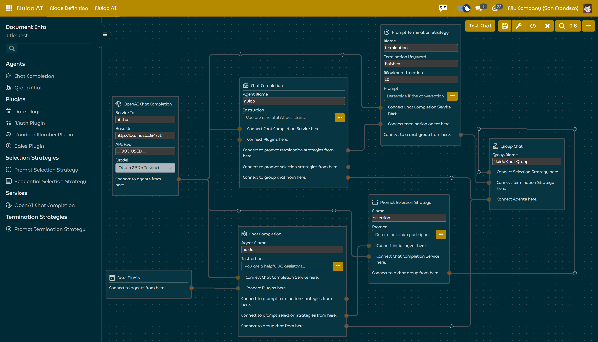
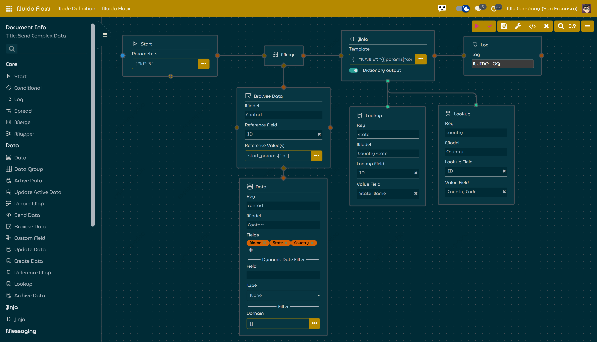

Nuido is an experimental node-based user interface library designed specifically for Odoo, an open-source ERP and CRM system. The purpose of this project is to explore the potential benefits of node-based user interfaces in improving how users interact with and configure their Odoo applications by providing a flexible (semi-) visual programming environment.

While Nuido aims to reduce the reliance on traditional coding skills, some level of programming knowledge may still be required when developing custom nodes or creating complex logic within existing nodes. This unique approach combines the power of node-based interfaces with traditional coding techniques to create more sophisticated and tailored applications for the Odoo ecosystem.

The development of Nuido and its associated experiments showcases the potential of combining node-based user interfaces with traditional coding techniques to enhance the Odoo experience. As the project continues to evolve, it is expected that more users will discover the benefits of a visual programming approach to application configuration and development within the Odoo ecosystem, even if some level of coding skills is still required.

By utilizing OWL, Nuido enables developers to reuse their existing skills and knowledge while exploring new ways to interact with and customize Odoo applications through node-based interfaces. This combination of reusability and innovation has the potential to significantly improve the user experience and enhance productivity within the Odoo ecosystem.

## Experiments based on Nuido
Currently there are two experiments developed based on Nuido:
### NuidoAI - AI Chatbot Designer
||
|:--:|
| *Nuido AI* |

NuidoAI allows users to design and configure AI chatbots using a user-friendly drag-and-drop interface. Leveraging the power of Semantic Kernel components, NuidoAI enables you to create chatbots tailored to your specific needs.

### Nuido Flow - Automation App
||
|:--:|
| *Nuido Flow* |
Nuido Flow provides a visual way to build complex workflows and automate processes within Odoo. With its node-based interface and pre-built components, Nuido Flow can help users to streamline their workflow and boost productivity.