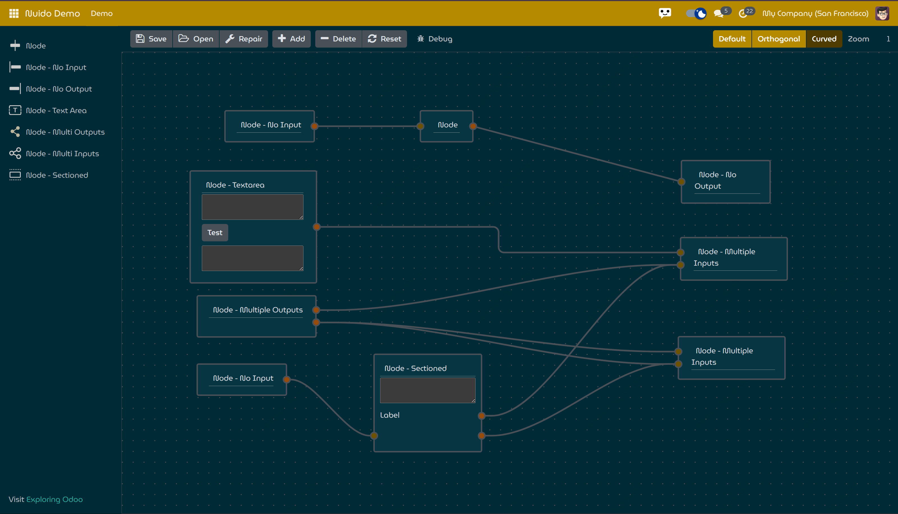

There are two methods to use nuido:
1. Extend the `NuidoUi` component and register it as client action.
2. Use `NuidoUi` as sub-component in a client action component.

Please see [Nuido Demo](https://github.com/yonitjio/exploring-odoo/tree/18.0-nuido/nuido_demo) for more details.

||
|:--:| 
| *Nuido Demo* |